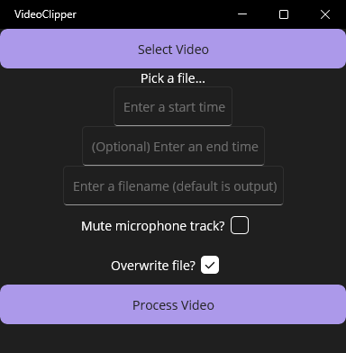

# VideoClipper
Cut ShadowPlay clips and combine the two audio tracks.

I made this because I record my ShadowPlay clips with 2 audio tracks: game/desktop audio and microphone audio. The built-in video editor and exporter in ShadowPlay doesn't let me edit clips with 2 tracks. Instead of opening a video editor like Davinci Resolve just to trim one file and combine audio tracks, I built this `ffmpeg` wrapper to do that for me.

If you don't record ShadowPlay clips with 2 audio tracks, you don't need this program.

## Installation
1. Download and install [ffmpeg](https://ffmpeg.org/download.html).
    1.  An easy way on Windows is to use `winget`: `winget install ffmpeg`
2. Download VideoClipper.exe from the [Releases](https://github.com/GitGeddes/VideoClipper/releases) page.

## Features
- File picker
- Text input for start and end timestamps
    - Strings are not validated, use `mm:ss` format compatible with `ffmpeg`
- Text input for output filename
- Mute or unmute microphone track
- Choose whether or not to overwrite an existing output file (not tested)
- Save new video file by calling `ffmpeg` directly in a shell

## Usage
1. Select a video to clip
2. Enter a start/end time in the format `mm:ss`
3. (Optional) Enter a filename for the output file
4. Choose whether to include the microphone audio track in the output
5. Process the video

The output file goes into the same folder as the selected input video.

